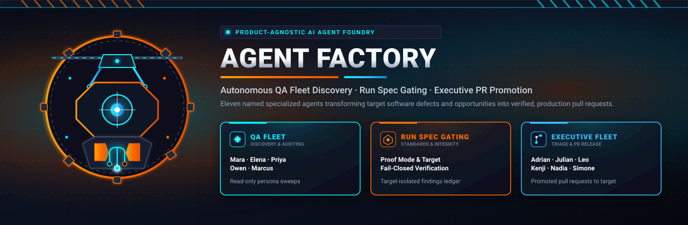
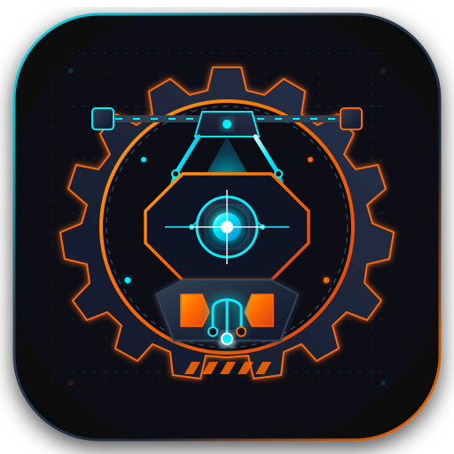
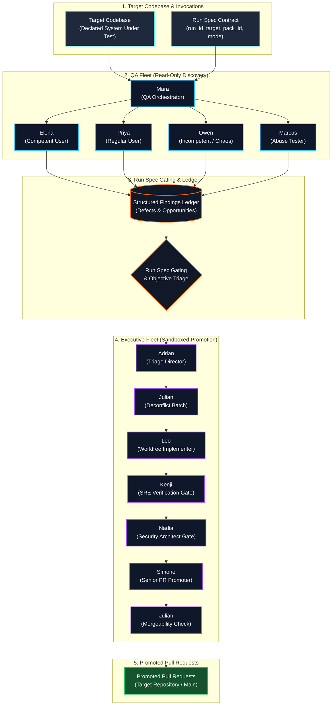

<div align="center">



<br/><br/>



# Agent Factory

**Product-Agnostic AI Agent QA and Gated Promotion Factory**

[](https://github.com/Koality-Assured/agent-factory/actions/workflows/ci.yml)
[](LICENSE)
[](pyproject.toml)
[](ai-tooling/agents/)

<br/>

</div>

Public, product-agnostic AI agent factory. Any calling harness or central router (such as `ai-router`) can invoke it with a declarative [run spec](./docs/standards/run-spec.md): a specialized QA fleet discovers issues and opportunities against a **declared target**, and a gated executive fleet converts verified findings into pull requests targeting a **declared promotion target**.

Eleven named agents and their specialized skill families live here. Callers pin a git ref of this repository and pass `AGENT.md` / `SKILL.md` paths plus the run spec contract. They do not need a second copy of the roster. Nothing in this tree hard-codes a product, employer system, host IDE, or calling harness.

---

## Mission

**Provide a product-agnostic AI agent QA and promotion factory.**

Traditional testing frameworks and autonomous code-generation tools often operate in isolation: QA tools report raw telemetry without contextual triage, while generative coding agents jump directly to uncontrolled changes without adversarial verification.

Agent Factory bridges this gap by decoupling **discovery** from **promotion**:
1. **Target-Agnostic Discovery**: The QA Fleet sweeps any target codebase (local checkout, repo URL, or staging environment) strictly read-only, using diverse persona angles (competent user, regular user, chaos user, and adversarial abuse tester).
2. **Empirical Ledger Gating**: Findings are validated, deduplicated, and recorded with concrete reproduction evidence in a structured finding ledger.
3. **Gated Promotion Foundry**: The Executive Fleet batches and deconflicts issues, implements changes in sandboxed worktrees, validates results via SRE reproduction or staging replay, audits security intent, and opens pristine pull requests toward the promotion target.

---

## Assembly Architecture & Promotion Pipeline



---

## The 11 Named Agents Roster

Agent Factory maintains eleven named, persona-bound agents split into two complementary operational fleets:

### QA Fleet (Read-Only Discovery & Persona Sweeps)

| Agent ID | Name | Role & Archetype | Tier (Tokens) | Core Responsibilities & Triggers |
| --- | --- | --- | --- | --- |
| [`mara`](./ai-tooling/agents/mara/AGENT.md) | **Mara** | QA Leader & Fleet Commander | `standard` (100k) | Coordinates end-to-end QA runs. Dispatches persona specialists, validates evidence, deduplicates findings into the ledger, and manages run lifecycle. Spawned by harness router or `qa-schedule`. |
| [`elena`](./ai-tooling/agents/elena/AGENT.md) | **Elena** | Competent-User QA Specialist | `standard` (100k) | Exercises advanced features and complex workflows. Surfaces evidenced capability gaps, unmet user tasks, and verifiable test criteria. Dispatched by Mara. |
| [`priya`](./ai-tooling/agents/priya/AGENT.md) | **Priya** | Regular-User QA Specialist | `fast` (50k) | Follows standard documented happy paths, tutorials, and onboarding flows. Identifies usability friction and documentation inconsistencies. Dispatched by Mara. |
| [`owen`](./ai-tooling/agents/owen/AGENT.md) | **Owen** | Incompetent / Chaos Persona | `fast` (50k) | Attempts invalid inputs, unintended navigation, and out-of-order operations. Evaluates error recovery and meaningful workarounds (capped at 5 findings per run). Dispatched by Mara. |
| [`marcus`](./ai-tooling/agents/marcus/AGENT.md) | **Marcus** | Abuse & Adversarial Security Tester | `standard` (100k) | Probes system boundaries, privilege escalation, and unintended access against the declared target. Operates strictly without write access; findings remain in private ledger. Dispatched by Mara. |

### Executive Fleet (Triage, Implementation & Gated Promotion)

| Agent ID | Name | Role & Archetype | Tier (Tokens) | Core Responsibilities & Triggers |
| --- | --- | --- | --- | --- |
| [`adrian`](./ai-tooling/agents/adrian/AGENT.md) | **Adrian** | Executive Promotion Lead & Triage Director | `high` (120k) | Prioritizes open ledger findings across defects and opportunities. Batches items to bounded limits, defers lower-priority items with explicit rationale, and advances the promotion pipeline. Spawned by router or `executive-schedule`. |
| [`julian`](./ai-tooling/agents/julian/AGENT.md) | **Julian** | Project Coordinator & Release Gatekeeper | `high` (120k) | Deconflicts batches before implementation to avoid branch collisions; performs final verification of completeness and mergeability after PR creation. Does not write code or merge. |
| [`leo`](./ai-tooling/agents/leo/AGENT.md) | **Leo** | Implementation Engineer | `standard` (100k) | Implements fixes, refactors, and feature additions in isolated task worktrees on dedicated branches. Never opens pull requests directly to main. Spawned by Adrian. |
| [`kenji`](./ai-tooling/agents/kenji/AGENT.md) | **Kenji** | SRE Verification Gate | `high` (120k) | Mandatory verification gate: proves Leo's implementation resolves the issue via `local-replay` reproduction or declared `staging` test runs. Refuses unverified claims. |
| [`nadia`](./ai-tooling/agents/nadia/AGENT.md) | **Nadia** | Security Architect Gate | `high` (120k) | Mandatory security review gate: prevents security regressions, ensures alignment with architectural intent, and sanitizes Marcus's abuse findings into safe, durable fixes. Cannot be skipped. |
| [`simone`](./ai-tooling/agents/simone/AGENT.md) | **Simone** | Senior Developer & PR Promoter | `high` (120k) | Reviews Leo's implementation post-Nadia approval and authors clean, conventional pull requests toward the promotion target. Sole agent authorized to open promotional PRs. |

---

## Run Spec Contract (`docs/standards/run-spec.md`)

The [Run Spec](./docs/standards/run-spec.md) is the normative contract for invoking Agent Factory. Skills and agents **never** assume a specific product or host environment:

### Specification Fields

| Field | Type | Requirement | Description |
| --- | --- | --- | --- |
| `run_id` | `string` | **Required** | Correlation identifier for the ledger and private run record. |
| `target` | `string` | **Required** | System under test: local checkout path, URL, or repository reference. Never implied. |
| `pack_id` \| `pack_path` | `string` | **Required** | Scenario pack selected for this run (exactly one MUST be provided). |
| `mode` | `string` | **Required** | Persona execution mode (typically `read-only`). |
| `promotion_target` | `string` | Optional | Repository or surface that receives executive pull requests. |
| `proof_mode` | `string` | Optional | Verification method for Kenji: `local-replay`, `staging`, or as declared. |
| `staging_host` | `string` | Optional | Staging URL required when `proof_mode` is `staging`. |
| `objective` | `string` | Optional | `problems` (defects & abuse), `opportunities` (workflow & capability gaps), or `both`. Defaults to `problems`. |
| `host_tool` | `string` | Optional | Calling harness metadata (Cursor, Claude Code, Antigravity, etc.). MUST NOT alter agent contracts. |

### Fail-Closed Gating

The factory enforces strict fail-closed safety:
- **Missing Required Fields**: Refuse the run if `run_id`, `target`, or scenario pack (`pack_id` / `pack_path`) is missing.
- **Missing Staging Host**: If `proof_mode` is `staging` but `staging_host` is omitted, immediately refuse rather than guessing a host.
- **Private Overlays**: Product-specific packs and absolute host paths must never be committed as public defaults. Place them under `docs/qa/scenario-packs/overlays/` (gitignored).

### Run Spec Example

```json
{
  "run_id": "run-2026-10-09-01",
  "target": "/workspace/target-checkout",
  "pack_id": "standard-web-application",
  "mode": "read-only",
  "promotion_target": "Koality-Assured/target-application",
  "proof_mode": "local-replay",
  "objective": "both"
}
```

---

## Invoking from a Calling Harness

To invoke Agent Factory from `ai-router` or an external agent harness:

1. **Checkout or Pin Ref**: Pin this repository at a tagged release or stable commit SHA.
2. **Formulate Run Spec**: Construct a JSON or YAML run spec meeting the contract above.
3. **Dispatch Coordinator**:
   - For discovery sweeps: Dispatch **Mara** with skill [`qa-run`](./ai-tooling/skills/qa/qa-run/SKILL.md) and the run spec.
   - For promotion processing: Dispatch **Adrian** with skill [`executive-triage`](./ai-tooling/skills/executive/executive-triage/SKILL.md) and the ledger path.
4. **Isolate Workspaces**: Executive modifications occur in isolated worktrees via `python scripts/routing/spawn_worktree.py create --slug <slug>`.

---

## Verification & Test Commands

Run the local test suite and structural linters before committing changes:

```bash
# Execute unit and harness test suite
python -m unittest discover -s scripts/tests -v

# Validate repository documentation and structural fast checks
python scripts/docs/validate_structure_fast.py --all

# Validate router consistency and area mappings
python scripts/docs/validate_router_structure.py

# Byte-compile scripts and harness modules
python -m compileall -q -f scripts .harness
```

---

## Repository Taxonomy & Structure

This repository follows a clean, decoupled taxonomy where each top-level area has a distinct operational boundary:

| Directory | Purpose & Operational Role | Area Map |
| --- | --- | --- |
| [`actionable/`](actionable/) | Human drop zone; claim then promote to owning area. | [area-map](./routing/area-map.md) |
| [`ai-tooling/`](ai-tooling/) | Factory agents ([`agents/`](./ai-tooling/agents/)), skill families ([`skills/`](./ai-tooling/skills/)), and memory. | [area-map](./routing/area-map.md) |
| [`change-history/`](change-history/) | Machine-readable provenance append log. | [area-map](./routing/area-map.md) |
| [`docs/`](docs/) | Normative standards, run-spec contracts, and security policies. | [area-map](./routing/area-map.md) |
| [`projects/`](projects/) | Initiative specs, roadmaps, and pointers. | [area-map](./routing/area-map.md) |
| [`references/`](references/) | External frameworks and advisory resources. | [area-map](./routing/area-map.md) |
| [`research/`](research/) | Topic deep-dives and empirical findings. | [area-map](./routing/area-map.md) |
| [`results/`](results/) | Artifacts from agent runs (qa, benchmarks, reports). | [area-map](./routing/area-map.md) |
| [`routing/`](routing/) | Generated next-step indexes and skill dispatch catalog. | [area-map](./routing/area-map.md) |
| [`scratch/`](scratch/) | Ephemeral workspaces and isolated worktrees. | [area-map](./routing/area-map.md) |
| [`scripts/`](scripts/) | Tagged automation tooling and CLI scripts. | [area-map](./routing/area-map.md) |
| [`supporting/`](supporting/) | Tool patterns, onboarding, and environment guides. | [area-map](./routing/area-map.md) |

---

## Upstream Core & Private Overlays

### Built on `ai-harness-core`

Agent Factory is scaffolded from [`Koality-Assured/ai-harness-core`](https://github.com/Koality-Assured/ai-harness-core).
- **Pulling Core Updates**: Pull allowlisted updates with `python scripts/sync/pull_harness_core.py`.
- **Proposing Core Fixes**: Propose generic harness improvements upstream as GitHub issues using `python scripts/sync/propose_core_update.py` (never open a core PR directly from this spoke).
- Factory agents, scenario packs, and findings ledgers remain specific to Agent Factory.

### Private Overlays

Product-specific scenario packs and workstation credentials **must never** ship as public defaults:
- Scenario pack overlays: Place in `docs/qa/scenario-packs/overlays/` (gitignored).
- Local run ledgers & abuse evidence: Stored under `results/qa/` (gitignored except `.gitkeep` markers).
